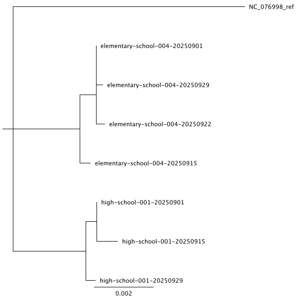
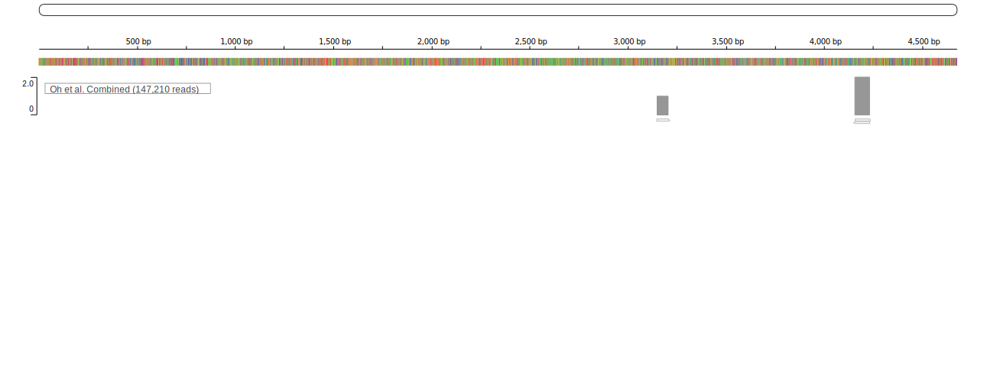

# Common densoviruses in the human and mammalian virospheres

Densoviruses (subfamily Densovirinae, family Parvoviridae) are small, non-enveloped T=1 icosahedral single-stranded DNA viruses with linear genomes typically ranging from 4 to 6 kb that terminate in hairpin structures serving as replication origins ([Cotmore et al., 2019](https://doi.org/10.1099/jgv.0.001212)). Their genome organization follows the characteristic parvoviral pattern, with a 5′ nonstructural block encoding NS proteins including the SF3 helicase/endonuclease NS1, and a 3′ capsid block encoding VP proteins. These viruses make extensive use of alternative promoters, leaky scanning, and splicing to generate multiple gene products ([Guérin et al., 2015](https://doi.org/10.1128/JVI.01719-14)). At the genus level, densoviruses exhibit meaningful architectural variation. Iteradensoviruses employ a monosense transcription strategy and produce multiple VP size variants ([ICTV Iteradensovirus Report, 2025](https://ictv.global/report/chapter/parvoviridae/parvoviridae/iteradensovirus)), whereas Ambidensoviruses use an ambisense arrangement with oppositely oriented NS and VP cassettes ([ICTV Ambidensovirus Report, 2025](https://ictv.global/report/chapter/parvoviridae/parvoviridae/ambidensovirus)). ICTV taxonomy recognizes multiple densovirus genera distributed across two deep evolutionary branches within Densovirinae, underscoring their long-standing diversification in invertebrates ([ICTV Densovirinae Report, 2023](https://ictv.global/report/chapter/parvoviridae/parvoviridae/densovirinae); [ICTV Parvoviridae Report, 2023](https://ictv.global/report/parvoviridae)).

Evidence for densovirus infection of mammals remains limited, and most detections in mammalian samples are interpreted as environmental or dietary transit from infected invertebrates rather than productive replication. For instance, densovirus sequences recovered from insectivorous bat feces cluster with arthropod densoviruses ([Li et al., 2012](https://doi.org/10.1128/JVI.06671-11)), consistent with ingestion and passive gut transit. The most striking human-linked genome is human CSF-associated densovirus 1 (HuCSFDV1), which was detected and independently confirmed in cerebrospinal fluid from a patient with anti-NMDA-receptor encephalitis. Although highly divergent, this genome falls within iteradensovirus-like lineages ([Phan et al., 2016](https://doi.org/10.1007/s00705-016-3002-9)). Additional human associations include metagenomic detection of densovirus-like sequences in plasma from Cameroonian blood donors participating in blood-borne virus surveillance, again without evidence of a sustained clinical syndrome or demonstrated human tropism ([Orf et al., 2023](https://doi.org/10.3390/v15041022)). Densoviruses have also been noted as low-abundance members of the cutaneous DNA virome in longitudinal shotgun metagenomic surveys of healthy skin ([Oh et al., 2016](https://doi.org/10.1016/j.cell.2016.04.008)). Moreover, a novel densovirus was recently identified in air samples collected from a Belgian day care facility ([Karatas et al., 2025](https://pmc.ncbi.nlm.nih.gov/articles/PMC12475893/)). Together, these reports suggest that densovirus sequences can be recovered from human-associated samples, but whether they represent rare vertebrate infection, transient carriage, or contamination remains unresolved. No robust experimental system has yet demonstrated efficient densovirus replication in vertebrate cells in vitro or in vivo ([Phan et al., 2016](https://doi.org/10.1007/s00705-016-3002-9); [Cotmore et al., 2019](https://doi.org/10.1099/jgv.0.001212)).

The interpretation of such sporadic detections is changing rapidly as sequence-based interrogation of the Sequence Read Archive (SRA) has become practical at petabase scale. Early efforts such as Serratus used cloud-based ultra-high-throughput alignment of SRA runs to reference sets, effectively bringing targeted BLAST-like screening to millions of datasets. However, these approaches still required substantial computational resources and were optimized for family-level discovery rather than arbitrary ad hoc queries ([Edgar et al., 2021](https://doi.org/10.1038/s41586-021-04332-2); [Serratus Project, 2020](https://serratus.io/)). More recent indexing approaches build searchable k-mer or graph representations of SRA content. Logan-search allows users to submit a short query sequence and receive ranked SRA accessions likely to contain matching reads within minutes ([LoganSearch GitHub, 2025](https://github.com/IndexThePlanet/LoganSearch); [Logan Consortium, 2024](https://doi.org/10.1101/2024.07.30.605881)). MetaGraph similarly indexes public read sets into compressed de Bruijn graph structures that enable rapid presence/absence and abundance queries over petabases of data, with follow-up alignment providing nucleotide-level confirmation ([Karasikov et al., 2024](https://doi.org/10.1038/s41592-024-02280-z); [Karasikov et al., 2025](https://doi.org/10.1038/s41586-025-09603-w)). In practical terms, these frameworks extend BLAST-like functionality to the entire SRA, transforming what was previously computationally expensive or prohibitive into web searches that can be completed in minutes ([Karasikov et al., 2024](https://doi.org/10.1038/s41592-024-02280-z); [Logan Consortium, 2024](https://doi.org/10.1101/2024.07.30.605881)).

Like the Belgian group and [others](https://pubmed.ncbi.nlm.nih.gov/40222255/), we have been developing air sampling as a metagenomic surveillance platform for human viruses. Using Thermo Fisher AerosolSense samplers deployed in built environments, we demonstrated that sequence-independent workflows coupled with deep sequencing can recover diverse respiratory and enteric viruses directly from ambient air, including influenza A/C, RSV, seasonal coronaviruses, rhinovirus, SARS-CoV-2, rotavirus, and astroviruses. These findings validated air metagenomics as a practical complement to clinical and wastewater surveillance ([Minor et al., 2023](https://doi.org/10.1038/s41598-023-48352-6)). In parallel, air monitoring has been extended to ports of entry. Active samplers placed near customs and immigration areas of major U.S. international airports generated nucleic acids that were processed by hybrid-capture enrichment using Illumina RNA Prep with Enrichment and the Respiratory Virus Oligo Panel. This approach enabled metagenomic recovery of dozens of viral taxa and high-quality genomes for SARS-CoV-2, influenza, bocavirus, and seasonal coronaviruses from airport air samples ([Gratalo et al., 2025](https://doi.org/10.1101/2025.09.22.25336185)). Together, these studies establish that low-biomass air samples can be rendered sequence-informative by combining high-volume aerosol capture with unbiased or capture-enriched metagenomics, and that the approach scales from local congregate settings to globally connected travel hubs.

During our continued analysis of air metagenomic datasets generated through these efforts, we repeatedly observed densovirus contigs closely related to the previously described HuCSFDV1. These sequences appeared across multiple independent air samples and settings. This unexpected recurrence provided a rationale to revisit the question of densoviruses in mammals using orthogonal data streams. Specifically, it motivated three linked investigations: targeted screening of additional air samples collected through our ongoing surveillance network; systematic mining of public SRA datasets for reads related to HuCSFDV1-like sequences using petabase-scale search tools; and re-analysis of previously described human metagenomes to quantify and contextualize densovirus signals.

## Results

### HuCSFDV1 is commonly found in air samples from congregate spaces

We collected air samples from congregate indoor spaces in K-12 schools essentially [as previously described]([Ellis et al., 2025](https://www.medrxiv.org/content/10.1101/2025.10.21.25338488v1); [Gratalo et al., 2025](https://doi.org/10.1101/2025.09.22.25336185)). At most sites, a (now discontinued) [ThermoFisher AerosolSense](https://www.fishersci.com/shop/products/aerosolsense-airborne-pathogen-detection-solution/2900AA) sampler was run continuously for at least one day and usually ~3 days. One school in our program also uses an [InBio Apollo](https://inbio.com/apollo/) for air sample collection. Particulates were eluted in phosphate-buffered saline with 0.1% Tween, and total nucleic acids were extracted from the eluate on a [Promega Maxwell](https://www.promega.com/products/lab-automation/automated-dna-rna-extraction-purification-maxwell/) instrument. Nucleic acids were enriched for viruses using the Illumina VSP2 protocol [according to the manufacturer's recommendation](https://support.illumina.com/downloads/viral-surveillance-panel.html0). The purpose of target enrichment is monitoring conventional human pathogens; densoviruses are not included in the VSP probes and are therefore not specifically enriched. Sequences were obtained on an [Illumina NovaSeq X Plus](https://biotech.wisc.edu/dna-seq/illumina/) operated by the [UW-Madison Biotechnology Center](https://biotech.wisc.edu/dna-seq/illumina/). Three datasets comprising [102 total samples](analysis/01-air-samples/vsp/metadata/vsp-sample-metadata.md) were sequenced in independent VSP2 experiments.

We developed a [Snakemake workflow](workflows/read-mapping) that aligns reads to the HuCSFDV1 reference [NC_076998](https://www.ncbi.nlm.nih.gov/nuccore/NC_076998.1) using [minimap2 (v2.28-r1209)](https://github.com/lh3/minimap2) with short-read presets. The resulting alignments are processed through [samtools (v1.20)](https://www.htslib.org) for coordinate sorting, mate-pair fixing, and PCR duplicate removal, yielding indexed BAM files suitable for variant calling and coverage analysis.

As shown in Figure 1, 76 of the 102 samples from K-12 schools had at least one read mapped to HuCSFDV1. Although some low-level matches could reflect non-specific mapping, 14 of the samples had at least 100 reads mapped to HuCSFDV1. The sample with the strongest read support for HuCSFDV1, termed `high-school-001-20250901-pooled`, was collected between 2025-09-04 and 2025-09-08. A total of 2,355 reads from this sample mapped to HuCSFDV1, and the majority consensus sequence is 99% nucleotide identical to the reference, differing by 48 nucleotide substitutions.

> **Figure 1.** Air samples frequently have reads mapping to HuCSFDV1. An interactive IGV browser with these results is available [here](https://dholab.github.io/common-densoviruses/01-air-samples-vsp/). 

Fortuitously, two sampling sites (high-school-001 and elementary-school-004) each yielded more than 100 mapped reads in independent early, mid, and late September 2025 air samples. We developed [a script](analysis/01-air-samples/vsp/consensus-align-tree.sh) to compare sequences from these sites. For each September collection, we generated consensus sequences from indexed BAM files using `samtools consensus` (v1.20) with FASTA output and retaining ambiguous sites as N to avoid biasing downstream distance calculations. These sequences were [aligned](analysis/01-air-samples/vsp/alignments/consensus_plus_ref.aln.fasta) together with the NC_076998 reference using [MAFFT (v7.526)](https://mafft.cbrc.jp/alignment/software/) with default nucleotide parameters. Phylogenies were inferred with [IQ-TREE (v3.0.1)](https://iqtree.github.io) under a GTR+G model with 1,000 ultrafast bootstrap replicates, rooting on [NC_076998](https://www.ncbi.nlm.nih.gov/nuccore/NC_076998.1) to provide an external outgroup. As shown in Figure 2, the three elementary-school-004 consensus sequences formed a monophyletic cluster distinct from the three high-school-001 sequences, which similarly grouped together. This pattern is consistent with independent circulation of related but distinct HuCSFDV1-like variants in the two schools rather than repeated sampling of a single shared source.

> **Figure 2.** Phylogenetic tree of HuCSFDV1-like densovirus sequences from the air of an elementary and high school. The IQ-TREE files are available [here](analysis/01-air-samples/vsp/trees). 

We recently participated in another air sampling project at [international airports](https://www.medrxiv.org/content/10.1101/2025.09.22.25336185v3). Metagenomic sequencing with VSP enrichment was also performed on a subset of 159 of these samples (Bioproject: [PRJNA989177](https://www.ncbi.nlm.nih.gov/bioproject/?term=PRJNA989177); [SRA XML](analysis/01-air-samples/tgs/metadata/tgs-SraExperimentPackage.xml)). Reads from these datasets were downloaded and mapped to the HuCSFDV1 reference as described above. [Seven samples](analysis/01-air-samples/tgs/metadata/tgs-sample-metadata.csv) had a [single paired-end read](analysis/01-air-samples/tgs/consensus) that mapped to HuCSFDV1, and a BLASTN search against core-nt (as of 23 November 2025) unambiguously identified HuCSFDV1 as the most significant alignment for all seven. Unlike schools where air samplers are located primarily in cafeterias where students and staff dwell, the air samplers in airports were located in international arrival corridors. Arriving passengers would be in the vicinity of the air samplers only briefly, possibly accounting for the less robust detection of HuCSFDV1 reads. Nevertheless, these findings demonstrate that reads corresponding to this virus were found in multiple air samples from two international airports, Dulles and San Francisco, separated by thousands of miles.

### HuCSFDV1 is detected in NCBI SRA mammalian datasets

The HuCSFDV1 reference [NC_076998](https://www.ncbi.nlm.nih.gov/nuccore/NC_076998.1) was split into 1 kb segments. Each segment was input into [Logan Search](https://logan-search.org/dashboard) using the default threshold of 0.5 and the 'All' reference group. [The results](analysis/02-sra-mining/logan-search-output) of Logan Search for each segment were combined to create the set of matching SRA accessions. [This table](analysis/02-sra-mining/metadata/sra-metadata.md) shows all of the matching datasets. To explore HuCSFDV1-like reads in these SRA datasets, the reads were downloaded with fasterq-dump, mapped to the HuCSFDV1 reference, and maped reads were deduplicated as described above, yielding indexed BAM files that are visualized in Figure 3. Two human SRA datasets (SAMN05172265 and SAMN05172266) were deposited in 2016 in support of the original manuscript describing HuCSFDV1. Both were identified in this analysis, providing a sanity check on the use of Logan Search to find additional datasets containing HuCSFDV1-like reads.

> **Figure 3.** SRA datasets with reads mapping to HuCSFDV1. An interactive IGV browser with these results is available [here](https://dholab.github.io/common-densoviruses/02-sra-mining/). 

Clues to HuCSFDV1 infection in humans come from three additional human datasets with matches to HuCSFDV1 that were independent from the two datasets associated with the original discovery. The first was found in a [German investigation](https://pmc.ncbi.nlm.nih.gov/articles/PMC6819125/) ([Beltrán et al., 2019](https://doi.org/10.1172/JCI128475)) of CSF lymphocytes from a 28-year-old with subclinical neuroinflammation. The only 28-year-old described in the manuscript has the identifier code BF-H. In addition to providing independent confirmation that HuCSFDV1 can be detected in human CSF, this dataset used single-cell RNA sequencing. Unlike most of the Logan Search results which had reads mapping throughout the HuCSFDV1 genome, [SRR8478958](https://www.ncbi.nlm.nih.gov/sra/SRR8478958) was characterized by reads mapping entirely to NS3, consistent with NS3 expression in whatever target cell(s) are infected. The indices needed to deconvolute SRR8478958 into single cells are unfortunately not available, so at present we can only surmise that HuCSFDV1 transcripts are likely in CSF lymphocytes. 

The second human dataset, from BioSample [SAMN14427291](https://www.ncbi.nlm.nih.gov/biosample/SAMN14427291) is described in [Martinez-Fabregas et al. (2020)](https://doi.org/10.1016/j.celrep.2020.108545). Thanks to the assistance of Majid Kazemian and Suman Mitra who submitted the samples to SRA and provided additional information, we learned that the primary cells were collected from a healthy donor. PBMCs were purified from buffy coats and polarized toward a Th1 phenotype before bulk RNA sequencing. This finding again supports lymphocytes as a potential target for HuCSFDV1. The third dataset is from BioSample [SAMN02199191](https://www.ncbi.nlm.nih.gov/biosample/SAMN02199191), which was submitted as part of a [French study on RNA polymerase III subunit genes](https://pmc.ncbi.nlm.nih.gov/articles/PMC3875860/). These reads were derived from [human IMR90 cells](https://www.atcc.org/products/ccl-186), fibroblasts derived from a 16-week-old female fetus. Unlike the other two human studies, this study also included murine samples, raising the possibility that these hits could have been due to cross-contamination from mice. It is also possible, however, that viral detection in fibroblasts indicates that HuCSFDV1 can infect skin cells, potentially accounting for the frequent detection of HuCSFDV1 in air metagenomes that often includes nucleic acids sloughed from skin.

Murine datasets have a pattern of HuCSFDV1-like reads distinct from human samples. Unlike the human datasets where viral reads correlate with lymphocytes and fibroblasts, the majority of mouse samples with HuCSFDV1-related sequences derive from germ cells and brain tissue, with no lymphocyte samples represented. The sample with the highest mapped read count comes from BioSample [SAMN35556869](https://www.ncbi.nlm.nih.gov/biosample/SAMN35556869), a sperm sample from an [ETH Zurich study](https://www.ncbi.nlm.nih.gov/bioproject/PRJNA978525) examining epigenetic inheritance through ATAC-seq of mouse sperm chromatin. The second-largest cluster of samples originates from [PRJNA272507](https://www.ncbi.nlm.nih.gov/bioproject/PRJNA272507), representing the original development of Genome Architecture Mapping (GAM) in mouse embryonic stem cells, [described by Beagrie et al. in Nature](https://pmc.ncbi.nlm.nih.gov/articles/PMC5366070/) ([Beagrie et al., 2017](https://doi.org/10.1038/nature21411)). 

Brain-derived samples come from [PRJNA625732](https://www.ncbi.nlm.nih.gov/bioproject/PRJNA625732), a [2021 Nature study by Winick-Ng et al.](https://www.nature.com/articles/s41586-021-04081-2). The Salk Institute's [CEMBA project](https://www.ncbi.nlm.nih.gov/pmc/articles/PMC8494641/) ([Liu et al., 2021](https://doi.org/10.1038/s41586-020-03182-8)) contributed numerous brain samples using single-nucleus methylation sequencing.

None of the mouse studies with the most abundant HuCSFDV1 reads involve scRNAseq that could be used to identify which specific cell types contain viral transcripts. The predominance of germ cell and neural samples—rather than lymphocytes—in mouse datasets may reflect either different tissue tropism of a related murine virus, or alternatively, that these sample types are particularly amenable to detecting these viral reads. The absence of mouse CSF or lymphocyte datasets in the Logan Search results makes direct comparison with the human tissue tropism difficult to establish.

### Integrated analysis of NS1 from air, SRA, and known densovirus samples

To determine the relationship of the various samples with HuCSFDV1-like sequences and known densoviruses in NCBI GenBank, we evaluated NS1 sequence homology. NS1 is the most conserved protein across densoviruses and aligns far more reliably than full genomes that contain long non-coding hairpins, rapidly evolving VP regions, and frequent frameshifts in fragmented metagenomic contigs. An amino acid level comparison reduces nucleotide saturation and codon-usage noise, making it easier to distinguish genuinely divergent clades from alignment artifacts. 

A script describing the analysis is [here](analysis/03-phylogenetics/scripts/align.sh). We rooted the tree using four Parvovirinae NS1 sequences (human B19 erythroparvovirus, adenovirus-dependent AAV-like dependoparvovirus, feline protoparvovirus, and human bocaparvovirus) to provide a vertebrate outgroup that is clearly outside Densovirinae. This approach allowed us to polarize splits and test whether HuCSFDV1-like sequences cluster with known insect densoviruses or form a distinct vertebrate-associated branch. Putative NS1 amino acid FASTA sequences from [VSP air samples](analysis/03-phylogenetics/scripts/extract_vsp_ns1.py) and [Logan SRA hits](analysis/03-phylogenetics/scripts/extract_logan_ns1.py) were positionally inferred from the HuCSFDV1 reference. These NS1 sequences and NS1 sequences [extracted from Densovirinae NCBI Genbank entries](analysis/03-phylogenetics/scripts/extract_ns1.py) were concatenated. Low-information records containing only ambiguous characters were removed, and sequences were aligned with MAFFT (v7.526, `--auto`, 12 threads). A maximum-likelihood tree was inferred with IQ-TREE (v3.0.1) under LG+G4+F with 1,000 ultrafast bootstrap and 1,000 SH-aLRT replicates, rooting on the Parvovirinae outgroup to constrain the direction of evolution (Figure 4). All of the sequences from the air samples and SRA form a separate node from all other Densovirinae NS1 amino acid sequences.

> **Figure 4.** NS1 tree, with the HuCSFDV1-like node containing the original HuCSFDV1 sequence and all of the SRA and air samples from this manuscript shown in green. The complete IQ-TREE output is available [here](analysis/03-phylogenetics/trees).

### HuCSFDV1 may not be the only human-associated densovirus

We initially hypothesized that incidental detections of densoviruses in other human studies described above were also HuCSFDV1 that had been inadvertently misclassified. In a 2016 manuscript from ([Oh et al., 2016](https://doi.org/10.1016/j.cell.2016.04.008)), metagenomic sequencing was performed on 594 skin samples from 12 healthy individuals. One of these individuals, HV08, had 47 BioSamples that contained sequencing reads categorized as Acheta domestica (i.e., house cricket) densovirus in [Supplemental Table 2](https://www.cell.com/cms/10.1016/j.cell.2016.04.008/attachment/db43522c-ed59-47f2-a378-469abee3924b/mmc3.xlsx). To revisit these sequences, we created a list of [HV08 SRA accession numbers](analysis/04-skin-microbiome/metadata/HV08-SraAccList.csv) and downloaded these reads with fasterq-dump. We concatenated all HV08 reads and used minimap2 with a short-read preset to map against [all 1,266 densovirus sequences](data/reference/known_densoviruses_NCBI_genbank_2025-11-19.fasta.gz) in NCBI GenBank as of 19 November 2025. Surprisingly, only three reads mapped to HuCSFDV1 (Figure 5A), while 7,917 reads mapped to Acheta domestica densovirus (Figure 5B) as described in the original manuscript. 
 

> **Figure 5A.** Only three reads from HV08 map to HuCSFDV1.

> **Figure 5B.** 7,917 reads from HV08 map to [KF015279](https://www.ncbi.nlm.nih.gov/nuccore/KF015279) Acheta domestica densovirus isolate AdJP12, complete genome. An interactive IGV browser with these results is available [here](https://dholab.github.io/common-densoviruses/04-skin-microbiome/).

Another study ([Orf et al., 2023](https://doi.org/10.3390/v15041022)) of blood plasma from Cameroon found two volunteers (U172329 and U172471) with densovirus sequences that were virtually identical to each other but divergent from other known densoviruses. SRA reads from this project are available in [BioProject PRJNA1188190](https://www.ncbi.nlm.nih.gov/bioproject/PRJNA1188190). We downloaded the reads associated with this study, pooling reads from both patients because the densovirus reads are described as being virtually identical, and mapped to the 1,266 densovirus sequences. There were no reads mapped to HuCSFDV1. The most abundant mappings are to the Genbank sequences deposited as part of this manuscript with 6,190 reads (U172329) and 999 reads (U172471), as expected. Excluding these mappings, the next closest mapping has only 28 mapped reads to AY461507 (Mythimna loreyi densovirus, complete genome) (Figure 6).

> **Figure 6.** Densovirus reads from the plasma of two Cameroonian volunteers do not map to HuCSFDV1. However, the investigators reconstructed a novel densovirus from these patients that is well supported by sequencing reads. An interactive IGV browser with these results is available [here](https://dholab.github.io/common-densoviruses/05-cameroonian-plasma/).

Finally, the [Karatas et al., 2025](https://pmc.ncbi.nlm.nih.gov/articles/PMC12475893/)  study of air samples from a Belgian daycare also identified a novel densovirus by deep sequencing. Given the frequent detection of HuCSFDV1 in our air samples, it would not have been surprising to see HuCSFDV1 in these samples. Indeed, as shown in Figure 7A, HuCSFDV1-like reads were present in 18 of 46 samples. More interestingly, another divergent densovirus sequence, termed 'Creche densovirus' ([PQ335166](https://www.ncbi.nlm.nih.gov/nuccore/PQ335166)), appeared even more frequently, in 30 of 46 samples (Figure 7B).

> **Figure 7A.** HuCSFDV1 reads detected in 18 air samples collected from a Belgian daycare. 

> **Figure 7B.** Creche densovirus isolate env/indoorair/2022/BE7 is found frequently in the same Belgian daycare samples. An interactive IGV browser with these results is available [here](https://dholab.github.io/common-densoviruses/06-belgian-air/).

## Discussion

This study is tightly coupled to the recent emergence of petabase-scale SRA search tools, particularly Logan-Search and related graph and k-mer indexing approaches, that make rapid, sequence-specific exploration of public read archives feasible ([Logan Consortium, 2024](https://doi.org/10.1101/2024.07.30.605881); [LoganSearch GitHub, 2025](https://github.com/IndexThePlanet/LoganSearch)). The SRA was built during a period when storage capacity outpaced the ability to query the archive interactively, and the continued commitment to deposit raw reads and metadata has created a resource whose value is now expanding rather than plateauing ([NCBI SRA, 2025](https://www.ncbi.nlm.nih.gov/sra)). In a climate where biomedical infrastructure is increasingly evaluated for cost-effectiveness, the decision to preserve deep sequencing datasets at scale is proving prescient because it supports unforeseen secondary analyses such as the present work ([Logan Consortium, 2024](https://doi.org/10.1101/2024.07.30.605881); [Karasikov et al., 2024](https://doi.org/10.1038/s41592-024-02280-z)). A concrete example in our findings is the monozygotic twin multiple sclerosis cohort, where HuCSFDV1-like reads were present but not highlighted in the original study. Only through retrospective archive-wide querying could they be recognized as part of a reproducible signal ([Ingelfinger et al., 2022](https://doi.org/10.1038/s41586-022-04419-4)). The broader implication is that depositing sequence data in the SRA, despite real costs in time and effort for investigators, enables discovery of unexpected viral associations years after primary publication.

A limitation of SRA-centric discovery is that dataset biases and artifacts propagate. The archive is enriched for particular hosts, tissues, and protocols, and false signals can arise from recurrent reagent contaminants, index hopping, or study-specific laboratory workflows. However, several features of the HuCSFDV1-like pattern argue against these explanations. If HuCSFDV1 were primarily a reagent contaminant, we would expect near-ubiquitous low-level k-mer matches across SRA runs regardless of sample type, reflecting shared extraction kits and library construction pipelines. Instead, matches are concentrated in specific biological contexts and absent from large fractions of the archive surveyed here ([Logan Consortium, 2024](https://doi.org/10.1101/2024.07.30.605881); [LoganSearch GitHub, 2025](https://github.com/IndexThePlanet/LoganSearch)). Second, the host distribution of HuCSFDV1-like reads is not simply a by-product of the numerical dominance of human and mouse datasets in the SRA. Even when focusing on the major invertebrate taxa known to support densovirus replication, HuCSFDV1-like matches are essentially absent. As of 26 November 2025, the SRA contained 719,839 datasets associated with known densovirus-host clades (Blattodea 6,179; Diptera 374,969; Hemiptera 32,059; Hymenoptera 103,337; Lepidoptera 93,852; Orthoptera 10,253; Crustacea 78,320; Echinodermata 20,870), yet these taxa are virtually unrepresented among HuCSFDV1-positive accessions. This skew is difficult to reconcile with a model in which HuCSFDV1 is broadly circulating in canonical invertebrate hosts and only passively reaching mammals, and instead supports mammalian host association ([Phan et al., 2016](https://doi.org/10.1007/s00705-016-3002-9); [Cotmore et al., 2019](https://doi.org/10.1099/jgv.0.001212)).

Multiple independent observation streams now point in the same direction. HuCSFDV1 was originally discovered in CSF from a child with anti-NMDA-receptor encephalitis, and its genome was confirmed in independent laboratories, reducing the likelihood of a trivial artifact ([Phan et al., 2016](https://doi.org/10.1007/s00705-016-3002-9)). A second CSF detection in an unrelated dataset, also from a neuroinflammatory context, provides partial replication of that initial observation, although clinical interpretation should remain cautious ([Beltrán et al., 2019](https://doi.org/10.1172/JCI128475)). Beyond CSF, HuCSFDV1-like reads appear in human lymphocyte datasets, and related densovirus sequences have been detected in plasma from Cameroonian blood donors in a blood-borne virus surveillance study ([Orf et al., 2023](https://doi.org/10.3390/v15041022)). Densoviruses are additionally present at low but detectable levels in healthy human skin metagenomes, including longitudinal profiling in the Oh et al. cohort where they were noted but not analyzed in depth ([Oh et al., 2016](https://doi.org/10.1016/j.cell.2016.04.008)). Finally, our air metagenomic surveillance repeatedly recovers HuCSFDV1-like contigs from congregate human spaces, and a separate year-long indoor air virome study from a U.S. daycare center likewise detected a spectrum of human-associated DNA and RNA viruses in air, supporting the plausibility of persistent human bioaerosol signals that are not dominated by invertebrate material ([Prussin et al., 2019](https://doi.org/10.1186/s40168-019-0672-z)). The convergence of CSF, blood, immune-cell, skin, and air signals, across unrelated sampling frames and laboratories, makes a purely incidental exposure model predicated on invertebrate biomaterial increasingly strained.

Taken together, these findings provide preliminary but provocative evidence that HuCSFDV1 and closely related densoviruses occupy the human and mammalian virospheres more frequently than previously appreciated. This echoes other recent work suggesting that divergent densoviruses may have expanded into new vertebrate niches, including reports of highly divergent densovirus-like genomes in wild birds ([Dai et al., 2023](https://doi.org/10.1093/gigascience/giad001)). The long-standing view that densoviruses are principally invertebrate viruses may therefore be incomplete. The key remaining question is transmission. Although we cannot exclude spillover from an unrecognized insect reservoir through bites or ingestion, the repeated recovery of HuCSFDV1-like nucleic acids in human air samples raises the possibility of alternative routes, including human-to-human transmission or environmental persistence in human-occupied microhabitats. These hypotheses are not mutually exclusive, and defining whether HuCSFDV1 represents a true mammalian-adapted densovirus lineage, a virus with dual invertebrate and vertebrate cycles, or a recurrently introduced environmental agent will require more direct evidence of replication, tropism, and immune engagement in mammals.

The unexpected prevalence uncovered here argues that HuCSFDV1-like densoviruses should be evaluated as candidate human-associated viruses rather than dismissed as coincidental insect contaminants. The availability of HuCSFDV1-positive mouse datasets provides a practical path to mechanistic work, including reverse-genetics rescue of infectious virus and controlled in vivo infections. In parallel, broader epidemiologic inference will depend on expanding archive-scale screening with tools such as Logan-Search and MetaGraph, coupled with careful secondary validation, and on targeted sampling in additional human cohorts and built environments. Together, these steps should clarify host range, tissue tropism, and any associations with inflammation or disease, and determine whether HuCSFDV1-like densoviruses represent an underrecognized component of the human virome.

## Data availability

The VSP2 sequence reads are available in NCBI BioProject XX (TBD). Yes, we recognize the irony that our data isn't yet in SRA when we rely on data from SRA. We're working on it. All other reads are already available in SRA as described above.

## Authors and affiliations

Marc C. Johnson2,3, Shelby L. O'Connor1,4, David H. O'Connor1,4*

1 Department of Pathology and Laboratory Medicine, University of Wisconsin School of Medicine and Public Health, Madison, WI 53711, USA
2 Department of Molecular Microbiology and Immunology, University of Missouri School of Medicine, Columbia, MO 65211, USA
3 Christopher S. Bond Life Sciences Center, University of Missouri, Columbia, MO 65211, USA
4 Wisconsin National Primate Research Center, University of Wisconsin-Madison, Madison, WI 53715, USA
* Corresponding author: Dave O'Connor • <dhoconnor@wisc.edu>

Other co-authors will be added as the project evolves.

## Acknowledgements

This work is funded by [Inkfish](https://ink.fish).

This work would not have been possible without data submitted to NCBI SRA as acknowledged in the text. Searching SRA datasets for densovirus reads was made possible by [Logan Search](https://logan-search.org) ([GitHub](https://github.com/IndexThePlanet/LoganSearch)) and the work of the Logan Team.

We would like to thank [Adam Bailey](https://bailey.pathology.wisc.edu) for helpful discussions and preliminary conversations about modeling HuCSFDV1-related pathology in animal models. [Suman Mitra](https://scholar.google.com/citations?user=1gRtTPkAAAAJ&hl=en) and [Majid Kazemian](https://kazemianlab.com) provided information on SRR11392655. [Julie Segre](https://irp.nih.gov/pi/julie-segre) patiently helped us understand the sample composition of NCBI BioProject 46333.

Computing was performed on the UW-Madison Center for High Throughput Computing cluster. Claude Code, Claude Sonnet v4.5, Claude Opus v4.5, and ChatGPT v5.1 were used for research and text drafting. Claude Code was used the most, until it started generating spurious Usage Policy violations that required us to fallback to ChatGPT v5.1.